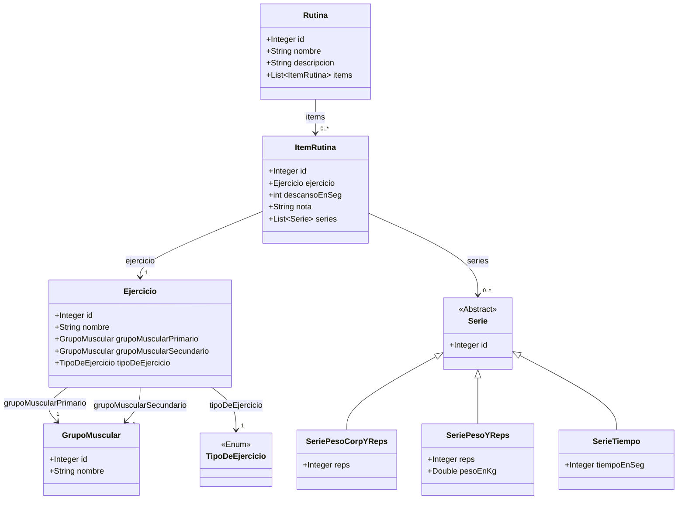

# myfitnessapp
Fitness Gym Routine Tracker App Project

```mermaid
classDiagram
    class Ejercicio {
        +Integer id
        +String nombre
        +GrupoMuscular grupoMuscularPrimario
        +GrupoMuscular grupoMuscularSecundario
        +TipoDeEjercicio tipoDeEjercicio
    }
    
    class GrupoMuscular {
        +Integer id
        +String nombre
    }
    
    class TipoDeEjercicio {
    <<Enum>>
    }
    
    class ItemRutina {
        +Integer id
        +Ejercicio ejercicio
        +int descansoEnSeg
        +String nota
        +List~Serie~ series
    }
    
    class Rutina {
        +Integer id
        +String nombre
        +String descripcion
        +List~ItemRutina~ items
    }
    
    class Serie {
    <<Abstract>>
        +Integer id
    }
    
    class SeriePesoCorpYReps {
        +Integer reps
    }
    
    class SeriePesoYReps {
        +Integer reps
        +Double pesoEnKg
    }
    
    class SerieTiempo {
        +Integer tiempoEnSeg
    }
    
    Ejercicio --> "1" GrupoMuscular : grupoMuscularPrimario
    Ejercicio --> "1" GrupoMuscular : grupoMuscularSecundario
    Ejercicio --> "1" TipoDeEjercicio : tipoDeEjercicio
    
    ItemRutina --> "1" Ejercicio : ejercicio
    ItemRutina --> "0..*" Serie : series
    
    Rutina --> "0..*" ItemRutina : items
    
    Serie <|-- SeriePesoCorpYReps
    Serie <|-- SeriePesoYReps
    Serie <|-- SerieTiempo

```
