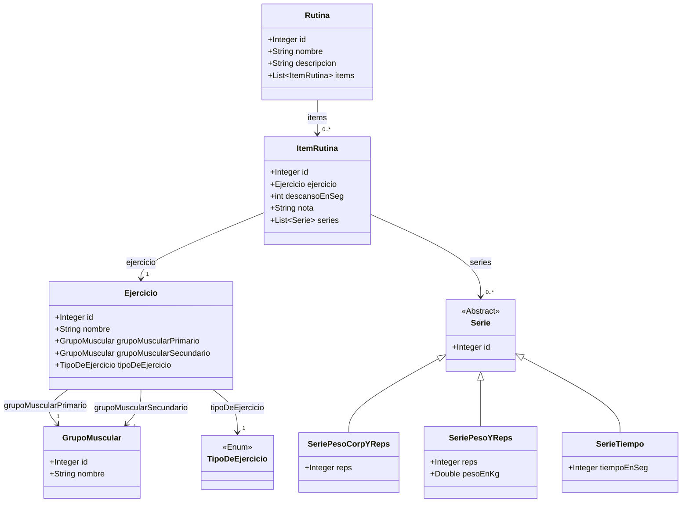

# My Fitness App

## Table of Contents

- [Overview](#overview)
- [Features](#features)
- [Technologies Used](#technologies-used)
    - [Backend](#backend)
    - [Frontend](#frontend)
- [Getting Started](#getting-started)

## Overview

My Fitness App is an web application designed to help users track their workout routines and monitor progress effectively. 

The app provides features for creating, customizing, and modifying exercises and workout routines, ensuring users can tailor their fitness plan to meet specific goals.

Additionally, it offers detailed tracking of personal statistics, allowing users to gain insights into their performance and improvements over time.

Whether you are a beginner or and advanced athlete, My Fitness App aims to make fitness tracking streamlined, motivating and personalized.

## Features

- CRUD operations for routines
- CRUD operations for exercises and sets
- CRUD operations for custom exercises
- CRUD operations for workouts
- Statistics per workout and exercise

Class Diagram
-------------

## Technologies Used

### Backend 

- Spring Boot 3
- Spring Data JPA
- Spring Web
- JSR-303 and Spring Validation
- OpenAPI and Swagger UI Documentation
- MySQL

### Frontend

- Angular
- Typescript
- Component-Based Architecture
- Lazy Loading
- OpenAPI Generator for Angular
- Bootstrap

## Getting Started

To get started with the My Fitness App project, follow the setup instructions in the respective directories:

- [Backend Setup Instructions](backend/README.md)
- [Frontend Setup Instructions](frontend/README.md)

